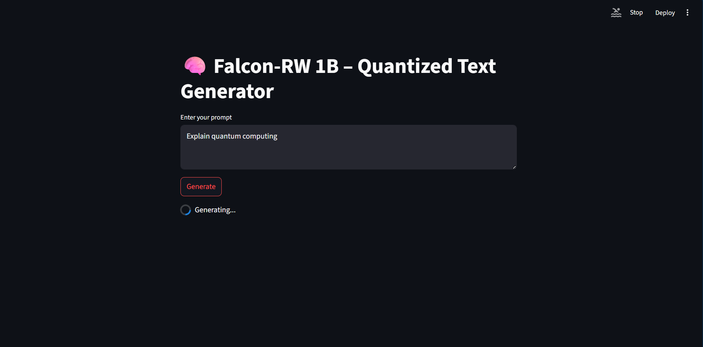

# Falcon-RW 1B Quantized Text Generation



## Overview
This project implements a text generation application using a 4-bit quantized version of the Falcon-RW 1B language model, integrated with a Streamlit-based user interface for real-time interaction. The application leverages Python 3.10 and demonstrates efficient deployment of large language models through quantization techniques, enabling reduced memory usage and inference on resource-constrained environments, such as consumer-grade CPUs or GPUs. The project utilizes 4-bit NormalFloat (NF4) quantization with double quantization, facilitated by the `bitsandbytes` library, alongside optimized model loading and inference workflows.

## Features
- **Quantized Model**: Employs 4-bit NF4 quantization to compress the Falcon-RW 1B model, minimizing memory usage while preserving generation quality.
- **Efficient Inference**: Supports inference on CPU or GPU with automatic device detection and optimized settings using `torch.bfloat16` compute dtype.
- **Interactive Interface**: Provides a Streamlit-based frontend for inputting prompts and displaying generated text.
- **Cached Model Loading**: Uses `@st.cache_resource` to load the model and tokenizer once, ensuring fast startup and response times.

## Technologies
- **Python Version**: 3.10
- **Core Libraries**:
  - `transformers`: Handles model and tokenizer operations.
  - `bitsandbytes`: Enables 4-bit quantization and double quantization.
  - `torch`: Manages tensor operations and model inference.
  - `accelerate`: Optimizes model loading and device management.
  - `streamlit`: Powers the web-based user interface.

## Project Structure
```bash
quantized-falcon-rw-1b/
├── app/
│   ├── config.py             # Configuration for model ID and quantization settings
│   ├── model_loader.py       # Logic for cached model and tokenizer loading
│   ├── inference.py          # Text generation functionality
│   └── ui_streamlit.py       # Streamlit frontend implementation
├── notebooks/
│   └── quantization.ipynb    # Jupyter notebook before refactoring
├── requirements.txt          # Project dependencies
├── README.md                # Project documentation
└── .gitignore               # Git ignore file
```


## Quantization Overview
Quantization reduces the precision of model weights and activations to lower-bit representations, enabling efficient inference with reduced memory and computational requirements. This project implements 4-bit NormalFloat (NF4) quantization, a format optimized for neural network weights, combined with double quantization to further compress quantization parameters. The `bitsandbytes` library facilitates this process, allowing the Falcon-RW 1B model to operate on hardware with limited resources while maintaining text generation quality. Key configurations include:
- **NF4 Quantization**: Maps weights to a 4-bit representation optimized for normal distributions.
- **Double Quantization**: Compresses quantization constants to minimize memory overhead.
- **bfloat16 Compute Dtype**: Utilizes 16-bit brain floating-point format for efficient computation during inference.

## Installation
1. **Install dependencies**:
   ```bash
   pip install -r requirements.txt
   ```
2. **Run the application**:
   ```bash
   streamlit run app/ui_streamlit.py
   ```

## Usage
1. Launch the Streamlit application in a web browser (URL provided upon running the command above).
2. Enter a text prompt (e.g., "Describe the applications of machine learning").
3. Click the "Generate" button to produce text using the quantized Falcon-RW 1B model.
4. View the generated text in the output section.

## Performance Considerations
- **Memory Efficiency**: 4-bit quantization reduces the model’s memory footprint by approximately 75% compared to full-precision (float32), enabling deployment on consumer-grade hardware.
- **Inference Speed**: Cached model loading and optimized inference settings ensure responsive text generation.
- **Device Flexibility**: The application automatically detects and utilizes available GPU (CUDA) or falls back to CPU.

## License
This project is licensed under the [MIT License](LICENSE).